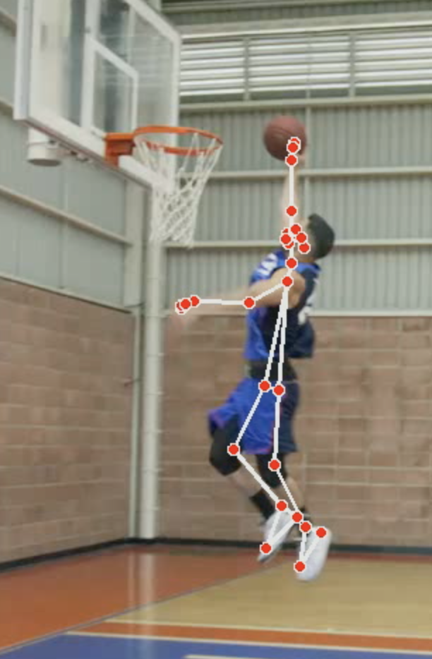
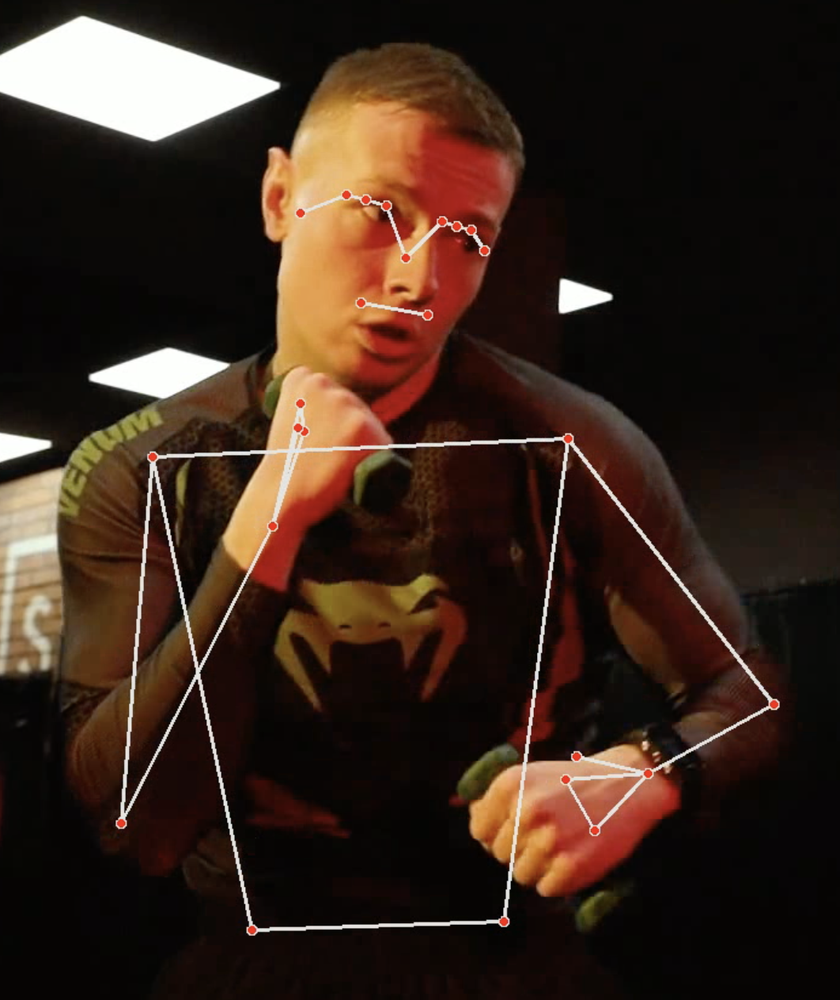
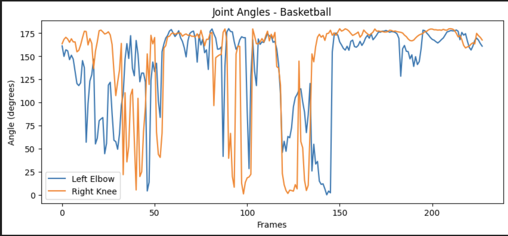
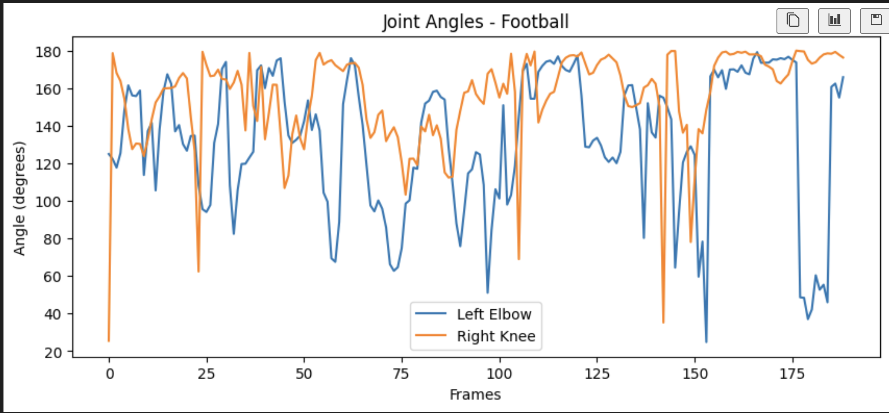

# DS (DifferentSports)-Estimation

This project demonstrates **pose estimation on athlete videos** using **OpenCV** and **MediaPipe** in Python. It tracks **joint angles** and generates **annotated videos** as well as **plots for movement analysis**.


## Features

-   Detects **human poses** in videos using MediaPipe.
-   Tracks **joint angles** (e.g., left elbow, right knee).
-   Annotates and saves processed videos (`*_pose.mp4`).
-   Plots **joint angles over time** for detailed analysis.
-   Supports **multiple athlete categories**: Basketball, Boxing, Football, Athletics, etc.

## Folder Structure

DS_PoseEsti/
├─ Videos/
│  ├─ basketball.mp4
│  ├─ basketball2.mp4
│  ├─ boxing.mp4
│  ├─ football.mp4
│  └─ athletics.mp4
├─ final.ipynb
└─ README.md

## Installation

1.  **Create and activate a Python virtual environment** (Python 3.11 is recommended):
    ```bash
    conda create -n pose_env python=3.11
    conda activate pose_env
    ```

2.  **Install the required packages**:
    ```bash
    pip install opencv-python mediapipe matplotlib numpy
    ```

## How to Run

1.  Place your athlete videos inside the `Videos/` folder.
2.  Open `final.ipynb` in VSCode or Jupyter Notebook.
3.  Run the notebook cells in the following order:
    -   Imports & functions
    -   Define categories
    -   Analyze videos
    -   Plot joint angles
4.  Annotated videos will be saved automatically in the same folder with the `*_pose.mp4` suffix.

## Demo / Output Examples 

Here is an example of the output you can expect from the project.

### Annotated Video Output

The script processes the input video and overlays pose landmarks and real-time joint angle data.




### Joint Angle Plots

After processing, the script generates plots that visualize the change in specific joint angles over the duration of the video, which is crucial for biomechanical analysis.



